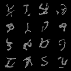

# minDiffusion

<!-- #region -->

Goal of this educational repository is to provide a self-contained, minimalistic implementation of diffusion models using Pytorch.

Many implementations of diffusion models can be a bit overwhelming. Under 200 lines of code, fully self contained implementation of DDPM with Pytorch is a good starting point for anyone who wants to get started with Denoising Diffusion Models, without having to spend time on the details.

Currently has:

- [x] Tiny implementation of DDPM
- [x] Denoising Diffusion Probabilistic Models

TODOS

- [ ] Refactor a code for bit.
- [ ] Add support for unet structure.
- [ ] DDIM
- [ ] Classifier Guidance
- [ ] Multimodality
